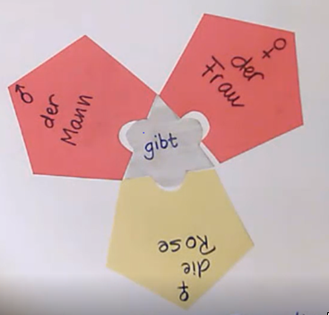
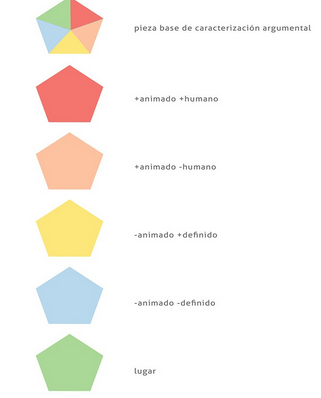

<h2 style="color: green; text-align: center;">A tener en cuenta</h2>

<h3 id="info">Objetivos</h3> 

&#9677; Definición del concepto de “caso”, tipos y ejemplos.

<h3 id="info">Destinatarios</h3>

&#9677; Cualquier persona con un nivel mínimo de conocimientos de Lengua equivalente a 3º ESO que desee aprender alemán

<h3 id="info">Destrezas a desarrollar</h3>

&#9677; saber identificar los casos en frases sencillas.

<h3 id="info">Tiempo estimado de aprendizaje</h3>

&#9677; 10 minutos de video lección o lectura y 10 de estudio y práctica

<h3 id="info">Conocimientos previos</h3>

&#9677; qué es un verbo y una frase

# ¿Qué significa el concepto de caso en gramática?

Nos referimos con el concepto de caso al papel que juega, dentro una frase las palabras que acompañan al verbo para completar su significado. Así, para entender la frase

El hombre da a la mujer la rosa &#8919; *Der Mann gibt der Frau die Rose*

Tenemos que buscar, en primer lugar, el verbo da (gibt). A continuación, nos tenemos que preguntar:

1. ¿quién da? der Mann (el hombre)
1. ¿a quién se da (o quien recibe)? die Frau (a la mujer)
1. ¿qué se da? die Rose (la rosa)

“Quien da”, juega el **papel principal**, que se llama papel **NOMINATIVO o caso NOMINATIVO**. “A quien da”, juega el papel de **DATIVO, o caso DATIVO**. Finalmente, “qué se da”, juega el papel de **ACUSATIVO**.
 
## El rompecabezas

\center

\

Entender una frase es como construir un rompecabezas, pero a partir de una pieza central, el verbo. 

<strong><em>Mirad:</em></strong>

&#9758; Busco primero el verbo

&#9758; Luego, el argumento que juega el papel principal, el caso Nominativo (quién da) que es la pieza der Mann.

&#9758; Y, a continuación, el resto de los argumentos: Dativo der Frau (a quien se le da), y el acusativo, die Rose (qué es lo que se da).

## Argumentos del verbo

\center

{ width=40% }\

Estas piezas der Mann, der Frau, die Rose se llaman argumentos del verbo. Fíjate que este verbo necesita tres argumentos (tres piezas) para tener sentido completo por eso decimos que es un verbo trivalente o con VALENCIA TRES. Otros verbos de valencia tres son comprar (kaufen), explicar (erklären), contar (erzählen), etc.

### Valencia del verbo

En este sentido, los verbos pueden ser 

* <strong>a</strong>valentes
* <strong>mono</strong>valentes 
* <strong>bi</strong>valentes y 
* <strong>tri</strong>valente

#### Avalentes

Son aquellos verbos que no necesitan argumentos como llover (*regnen*)

\center

\ 

#### Monovalentes

Son aquellos verbos que necesitan un argumento como reír (*lachen*)

\center

\

#### Bivalentes

Son aquellos verbos que necesitan dos argumentos como comer (*essen*)

\center

\

#### Trivalentes

Son aquellos verbos que necesitan tres argumentos como dar (*geben*)

\center

\

## Los rasgos semánticos

&#9760;

No todos los argumentos encajan en un caso. Por ejemplo, nunca podré decir “die Rose gibt dem Mann die Frau”, porque una rosa no tiene capacidad de dar. El verbo dar necesita de un argumento Nominativo que sea humano o con capacidad de pensar. Esto lo expresamos de forma resumida como +animado + humano. *+animado y +humano* son **propiedades** o **rasgos semánticos**.

El argumento  Acusativo, lo que se da, es, normalmente, un objeto inanimado, que se expresa de forma resumida como –animado, o también puede ser animado pero no humano), es decir, +animado -humano.

# Resumiendo las 5 ideas de la videolección

## Idea 1

El verbo es la  pieza principal de una frase. Es el que manda. Rige cuántos argumentos hay que poner, rige el caso de cada argumento y sus rasgos semánticos. 

Si has entendido esto has entendido todo, has entendido cómo funcionan las lenguas, el español, el alemán o la que sea.

## Idea 2

El caso es el papel o función que juegan las palabras de una frase respecto al verbo. 

## Idea 3

En alemán hay cuatro tipos de casos:

| caso           | pregunta      |
| :------------: | :-----------: |
| Nominativo     | ¿quién?       |
| Acusativo      | ¿qué?         |
| Genitivo       | ¿cómo?        |
| Dativo         | ¿a quién?     |

## Idea 4

El verbo puede “pedir” cero, una, dos o tres valencias, es decir, puede ser:

&#9758; avalente (no necesita argumento)

&#9758; monovalente (necesita sólo un argumento, normalmente en caso Nominativo)

&#9758; bivalente (necesita dos argumentos) o

&#9758; trivalente (necesita tres argumentos)

## Idea 5

Los rasgos semánticos de los argumentos son sus propiedades básicas y deben encajar con los rasgos semánticos que pide el verbo para cada caso. Los rasgos semánticos pueden ser:

|rasgos semánticos|
|:----:|
|+ animado + humano|
|+ animado – humano|
|- animado + definido|
|- animado - definido|

# ¡¡Buen trabajo!!

Has hecho un paso enorme en el aprendizaje del alemán.